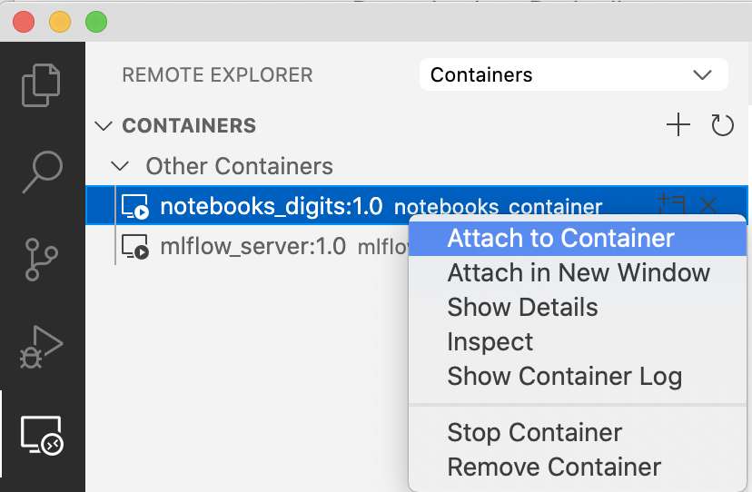
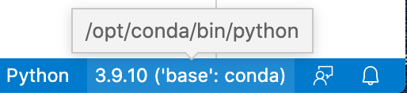

# Description

The goal of this project is to execute the whole framework of Machine Learning Operations (MLOps) on a simple digits recognizer model, using an open source stack (though S3 is used to store data and models artifacts, but any cloud provider could be used) and also on AWS SageMaker. The tentative stack will be:

* Docker and Kubernetes to run everything on top of them
* Jupyter Lab to run notebooks and prepare models
* MLFlow for model registry and experiment tracking
* Luigi or Prefect for pipelines
* Seldon for serving

Depending on other constraints, if possible, it will be replicated using AWS SageMaker.

A simple model based on a reduced MNIST dataset will be trained and iteratively improved with new data that will *arrive* from the MNIST dataset. Model and data will be registered and versioned, experiments tracked, and pipelines will be created.

The model will be deployed for serving. Eventually, it will receive new data not seen before from a different distribution (using the [DIDA dataset](https://didadataset.github.io/DIDA/)) which will produce a training-serving skew. Data drift will be evaluated via monitoring the model —and perhaps a human-in-the-loop (if easy to do) will be put to do ground truth labeling tasks (e.g. with [human-loop library](https://github.com/slrbl/human-in-the-loop-machine-learning-tool-tornado))— to do error analysis on the predictions, and retrain the model, ideally automatically.

References:

* [https://www.datarevenue.com/en-blog/mlops-for-research-teams](https://www.datarevenue.com/en-blog/mlops-for-research-teams)
* [https://www.datarevenue.com/en-blog/how-to-scale-your-machine-learning-pipeline](https://www.datarevenue.com/en-blog/how-to-scale-your-machine-learning-pipeline)
* https://neptune.ai/blog/how-to-monitor-your-models-in-production-guide
* https://docs.aws.amazon.com/sagemaker/latest/dg/model-monitor-model-quality-merge.html
* https://towardsdatascience.com/detecting-semantic-drift-within-image-data-6a59a0e768c6 


# Prerequisites

* An AWS account and an S3 bucket, plus a set of credentials to call the AWS API; a configured AWS CLI.
* Docker desktop


# Step 1

## Setting up Jupyter and MLFlow

A Makefile is provided to build the images and run the containers where Jupyter Lab and MLFlow server run.

**Setup note**: 

* It is necessary to add an AWS credentials file into ~/.aws/credentials in order to access the S3 bucket.
* Create a bucket in S3, which is where the experiments and models artifacts will be stored.

Execute `make run_mlflow` to run the MLFlow server, and then execute `make run_jupyter` to start the Jupyter Lab service.


Docker references:

* [https://towardsdatascience.com/deploy-mlflow-with-docker-compose-8059f16b6039](https://towardsdatascience.com/deploy-mlflow-with-docker-compose-8059f16b6039) setup of MLFlow with MySQL and NGINX on Docker
* [https://www.tutorialworks.com/container-networking/](https://www.tutorialworks.com/container-networking/)
* [https://docs.microsoft.com/es-es/visualstudio/docker/tutorials/multi-container-apps
](https://docs.microsoft.com/es-es/visualstudio/docker/tutorials/multi-container-apps)
* [https://docs.microsoft.com/es-es/visualstudio/docker/tutorials/use-docker-compose](https://docs.microsoft.com/es-es/visualstudio/docker/tutorials/use-docker-compose)
* [https://stackoverflow.com/questions/42385977/accessing-a-docker-container-from-another-container](https://stackoverflow.com/questions/42385977/accessing-a-docker-container-from-another-container) check networking with Docker compose

MLFlow references:

* [https://github.com/mlflow/mlflow/tree/master/examples/tensorflow/tf2](https://github.com/mlflow/mlflow/tree/master/examples/tensorflow/tf2)
* [https://www.mlflow.org/docs/latest/tracking.html#how-runs-and-artifacts-are-recorded](https://www.mlflow.org/docs/latest/tracking.html#how-runs-and-artifacts-are-recorded) Configuring the server
* [https://mlflow.org/docs/latest/model-registry.html](https://mlflow.org/docs/latest/model-registry.html)
* [Databricks Managed MLFlow - if you don't want to handle and host your own MLFlow server](https://databricks.com/product/managed-mlflow)


## Data preparation


Run `generate_data.ipynb` notebook to obtain and generate datasets to iteratively train the model.

The notebook `modeling.ipynb` contains a sample on how to train a simple NN model, create an MLFlow experiment and do several runs which are stored on S3 and on the docker volume named `dbdata` used by the MySQL server.

Open `http://localhost:5000` in your browser to inspect the experiments and artifacts.


# Step 2

## Developing with Containers

On step 1, an environment to run notebooks and keep track of experiments has been created. Now, the development will be moved into containers with the idea to create pipelines that can be separated into different steps.

From `pipelines/legacy_containers` directory, run:
`docker build -t digits-preprocess:1.0 src/preprocessing`, or better, run `make build_preprocess` to ensure everything is setup correctly.

To access the container, run: `make debug_preprocess`


To assist with the development using Visual Studio Code, the following extensions are required:

* Python (of course)
* Remote - Containers
* Remote - SSH
* Remote development

1. Once the container is running, go to the Remote Explorer and attach the container.


2. A set of components will be installed on the container, prompted by VSCode, when trying to run and debug (*You don't have an extension for debugging Python. Should we find a Python extension in the Marketplace?*). Proceed in order to be able to run and debug the files.

3. As the next step, at the bottom-right corner of the window, select the Python interpreter, by default it uses the default interpreter installed in the container instead of the Conda managed version.



4. As the final step, go to Run and Debug, and click on Run to install the required components onto the container where the code will run.

For getting help on how to debug, check [Debugging with VSCode](https://code.visualstudio.com/docs/editor/debugging)
In addition, check some specifics for Python config debugging for both local and remote options, [here](https://code.visualstudio.com/docs/python/debugging).

Once the python is run, you can configure a launch.json file to specify the required parameters, etc. E.g.:

```
{
    "version": "0.2.0",
    "configurations": [
        {
            "name": "Python: Current File",
            "type": "python",
            "request": "launch",
            "program": "${file}",
            "console": "integratedTerminal",
            "args": ["s3://digits-recognizer-project/input_data/mnist_data/", "samples_1k_X.npy", "processed_samples_1k_X.npy"],
            "justMyCode": true
        }
    ]
}
```

To debug the training and registration of the model, use this configuration:

```
{
    // Use IntelliSense to learn about possible attributes.
    // Hover to view descriptions of existing attributes.
    // For more information, visit: https://go.microsoft.com/fwlink/?linkid=830387
    "version": "0.2.0",
    "configurations": [
        {
            "name": "Python: Current File",
            "type": "python",
            "request": "launch",
            "program": "${file}",
            "console": "integratedTerminal",
            "args": ["s3://digits-recognizer-project/input_data/mnist_data/", "processed_samples_1k_X.npy",
                     "samples_1k_y.npy", 
                     "http://host.docker.internal:5000"], // or "http://mlflow_server:5000"
                     
            "justMyCode": true
        }
    ]
}
```

**References**:

[From inside of a Docker container, how do I connect to the localhost of the machine?](https://stackoverflow.com/questions/24319662/from-inside-of-a-docker-container-how-do-i-connect-to-the-localhost-of-the-mach)


### Deploy in Kubernetes (WIP)

To enable Kubernetes locally, enable Kubernetes in Docker Desktop, or, as an alternative use Minikube, but **do not** use Docker driver with Minikube, because port forwarding and tunneling do not work well or simply don't work at all on Mac. An alternative could be using a Virtualbox driver: `minikube start --driver=virtualbox` or Parallels driver if available on Mac: `minikube start --driver=parallels`

Follow [https://minikube.sigs.k8s.io/docs/start/](https://minikube.sigs.k8s.io/docs/start/) to run Minikube. I have used Minikube with VirtualBox driver and it does port-forwarding correctly. Another option that worked for port-forwarding was using Docker Desktop Kubernetes, but it doesn't have the Dashboard.

Use `eval $(minikube docker-env)` to push images directly into in-cluster Docker

Go to `docker/kubernetes` and run `kompose convert` (install instructions: [https://kompose.io/installation/](https://kompose.io/installation/)). It generates a set of yaml files to deploy the pods and the network service.

Note the following:

* The docker compose file is modified to remove the expose port, because for K8s a port forward command will be run.
* Added `imagePullPolicy: Never` to the `web-deployment.yaml`, otherwise an error is produced, at least when running on K8s for Docker Desktop. (Could this be a confusion between the images available? [Error trying to pull image](https://stackoverflow.com/questions/48592157/kubernetes-minikube-docker-trying-and-failing-to-pull-image), )

Run this to deploy the pods:
```
kubectl apply -f mlnetwork-networkpolicy.yaml,dbdata-persistentvolumeclaim.yaml,db-deployment.yaml,db-service.yaml,web-deployment.yaml,web-service.yaml
```

Run this to delete everything:
```
kubectl delete -f mlnetwork-networkpolicy.yaml,dbdata-persistentvolumeclaim.yaml,db-deployment.yaml,db-service.yaml,web-deployment.yaml,web-service.yaml
```

To access the MLFlow dashboard run `kubectl port-forward web-84ddbfc897-gzcs8 5000:5000`. You have to run first `kubectl get pods` to obtain the actual pod name (it will be different each time).

**References**:

* [https://aahansingh.com/mlflow-on-kubernetes](https://aahansingh.com/mlflow-on-kubernetes)
* [https://medium.com/pareture/network-with-localhost-in-your-docker-for-mac-kubernetes-cluster-b75dc87efc8d](https://medium.com/pareture/network-with-localhost-in-your-docker-for-mac-kubernetes-cluster-b75dc87efc8d) use `host.docker.internal` on Mac


# Step 3

## Pipeline orchestration

Luigi is used on this project to orchestrate workflows. For our current case, it is about preprocessing the data, training the model, and deploying it. Everything is run on Docker, but a conda environment is provided for local development.

* Go to `pipelines` directory and create a conda environment running `make prepare_conda_environment` (optional, just for local development)
* Go to subfolder `luigi` and run `make build_pipeline_images`
* Run `make run_pipeline` to execute the pipeline steps. Make sure to have the MLFlow server running from Step 1


Possible alternatives for execution:

* Run the code within Kubernetes to tie everything together.


**References**:

* [https://towardsdatascience.com/building-an-automated-machine-learning-pipeline-part-four-787cdc50a12d](https://towardsdatascience.com/building-an-automated-machine-learning-pipeline-part-four-787cdc50a12d)

* [https://www.datarevenue.com/en-blog/how-to-scale-your-machine-learning-pipeline](https://www.datarevenue.com/en-blog/how-to-scale-your-machine-learning-pipeline) for how to send luigi tasks to Kubernetes and using S3Target.

* [https://stackoverflow.com/questions/65944322/how-to-get-docker-images-created-from-docker-in-docker](https://stackoverflow.com/questions/65944322/how-to-get-docker-images-created-from-docker-in-docker) Use of /var/docker

* [https://stackoverflow.com/questions/65944322/how-to-get-docker-images-created-from-docker-in-docker](https://stackoverflow.com/questions/65944322/how-to-get-docker-images-created-from-docker-in-docker) Troubleshooting

**Notes for Prefect**:

Couldn't make it work with my current workflow goal (using Docker containers), there is not enough documentation and I would have to write and test code from scratch, but some stuff used tested was:

```
Within Makefile:
================
prepare_prefect_server: ## once the environment is ready start the server
	prefect server start

start_prefect_docker_agent: ## specify backend server, otherwise cloud is taken as default
	prefect backend server && \
	prefect agent docker start

create_prefect_project: ## it failed while trying to create using the UI, but works on the command line
	prefect create project "digits"
```

* Create and start the prefect server by running `make prepare_prefect_server`. It will retrieve a set of Docker images and create them. It is also possible to generate the server configuration by running `prefect server config > docker-compose.yml` to obtain a Docker compose configuration file.
* Run `make start_prefect_docker_agent` so the jobs can be directed to the Docker engine.
* Run `make create_prefect_project` to setup a project (named "digits") in Prefect. Open [Prefect dashboard on localhost](http://localhost:8080) to inspect the available flows and jobs for the project.


* [The Simple Guide to Productionizing Data Workflows with Docker](https://medium.com/the-prefect-blog/the-simple-guide-to-productionizing-data-workflows-with-docker-31a5aae67c0a) Run the workflow *inside* Docker. Python packaging.
* [Data Science DC Aug 2021 Meetup: Machine Learning Workflow Orchestration with Prefect](https://www.youtube.com/watch?v=gbzL5TIFZZY)
  - Workflow orchestration
  - Prefect and Dask
  - Parallel grid search on Dask
  

# Step 4: Model deploy

Seldon will be used for model deployment within a Kubernetes cluster.

Additional requirements: [Helm](https://helm.sh/docs/intro/install/)

Run this:

```
minikube start --driver=virtualbox --memory=8192
```

Follow instructions at: [https://docs.seldon.io/projects/seldon-core/en/latest/install/kind.html](https://docs.seldon.io/projects/seldon-core/en/latest/install/kind.html) (I succeeded using **istio**) until you get the following: 

```
kubectl get pods -n seldon-system
NAME                                       READY   STATUS    RESTARTS   AGE
seldon-controller-manager-b98fcbbf-45mb7   1/1     Running   0          15s

# Run next line to direct traffic to localhost:8080:
kubectl port-forward -n istio-system svc/istio-ingressgateway 8080:80

# Run:
kubectl create namespace seldon

# Run this to deploy a model:
kubectl apply -f - << END
apiVersion: machinelearning.seldon.io/v1
kind: SeldonDeployment
metadata:
  name: iris-model
  namespace: seldon
spec:
  name: iris
  predictors:
  - graph:
      implementation: SKLEARN_SERVER
      modelUri: gs://seldon-models/v1.14.0-dev/sklearn/iris
      name: classifier
    name: default
    replicas: 1
END


```


Run
`curl http://localhost:8080/seldon/seldon/iris-model/api/v1.0/metadata`


**References**:

* https://docs.seldon.io/projects/seldon-core/en/latest/install/kind.html

* [https://docs.seldon.io/projects/seldon-core/en/latest/workflow/github-readme.html](https://docs.seldon.io/projects/seldon-core/en/latest/workflow/github-readme.html) test a simple model deployment and perform requests to it 
* [MLOps Model Serving Tutorial - Seldon Core
](https://www.youtube.com/watch?v=L746MuYzX1c) Didn't work for local Minikube or creates too much complexity. The tutorial uses AWS EKS where it probably works properly.


# Future references

* [Drift Detection: An Introduction with Seldon](https://www.youtube.com/watch?v=JaPMFf0cKlM)

* Ideas for drift monitoring for multivariate data: [https://madewithml.com/courses/mlops/monitoring/#multivariate](https://madewithml.com/courses/mlops/monitoring/#multivariate)
* [https://aws.amazon.com/blogs/machine-learning/managing-your-machine-learning-lifecycle-with-mlflow-and-amazon-sagemaker/](https://aws.amazon.com/blogs/machine-learning/managing-your-machine-learning-lifecycle-with-mlflow-and-amazon-sagemaker/)
